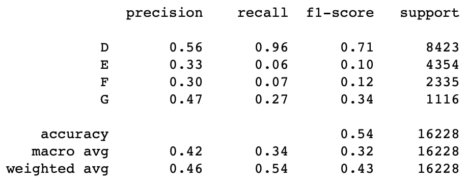

## CS4641 Group 15 Fall 2020

### Project: Using Machine Learning to Aid in the Mitigation of Wildfires

### Project Graphic/Overview:  

  

### Summary/Overview:

Our dataset that we are using contains information about 1.88 million US Wildfires. For each sample, there are data points on the location, name of the fire, date and time of the fire, size of the fire, as well as several codes corresponding to different fire classes that each fire is classified as. We are hoping to take this data and create meaningful insights that can aid in the mitigation efforts of wildfires, for example predicting the final size of a fire, predicting the cause of a fire, or predicting where and when fires are most likely to start. We plan to start by using unsupervised learning to focus on the clustering of different types of fires in order to get a better since of the data we are dealing with in terms of causes, sizes, and locations, and then we can move to supervised learning which will allow us to use tools like regression in order to predict the ultimate size of a fire given certain features of a fire that has started. When dealing with this regression step, we also anticipate pulling in other weather data that can help us build a succesful regression model. This is important to be able to predict as it has the most direct effect on people's lives - more so than cause or location of a fire. People need to know how big a fire is going to get and if we can build a tool that can accurately give them this information it could play an important role in keeping people safe.  

### Background:

There have previously been attempts by data scientists to deal with wildfires using machine learning. For example in reference (2), scientists attempted to predict the size of a wildfire given that it already started. They had a slightly more specific goal, which was analyzing the different types of kindling and how that affects burn area in Alaska. They were successfully able to identify certain natural features that would lead to fires burning out of control in that region. Another study focused on estimating population exposure to fires, which is interesting because it could potentially be very useful in terms of evacuation efforts and saving lives.

### Methods:

#### Unsupervised Section:  

##### Dataset
This dataset was obtained from Kaggle and contains 1.88 million records for U.S. wildfires from 1992 to 2015. Each entry contains 38 features including fire size as well as fire size class (a ranking from A to G based on fire size; see table below for size qualifications). 

##### Data Cleaning + Feature Reduction
Many features included in the dataset provided fire identification information or were irrelevant to fire size and were thus dropped from the dataset. Redundant features capturing identical information were simplified to the minimum number of features required to best represent the feature. 

We also tried to one-hot encode certain features of our data, most notably the different states. However, after encoding the values, we did not notice any strong correlation between different states and fire size, which is why we focus mostly on latitude and longitude in this report.

##### More Detailed Feature Analysis
During this unsupervised learning phase, we attempted to employ several clustering and density estimation algorithms to get a better understanding of our data. The first feature we looked at was location, as we thought that clustering by location might prove meaningful to split the data up. However, we ended up with a plot that didn’t tell us much information, as it turned out to simply be a map of the United States (indicating that there are fires everywhere—as expected). 

Since this plot told us nothing besides what we expected to be true, and our goal is to predict the size of a fire, we wanted to get a better estimator of how the sizes of fires were distributed on a map. For this we decided to use a Kernel Density Estimator, as it would tell us not only where fires occur but also how frequently (dense) fires occur in a certain location. To fully understand where each type of fire was occurring, we plotted the coordinates for each class of fire (A-G), and received the following fire distributions:
 
  
This was useful to us for a couple of reasons. First, it lets us visualize where and how frequently different sized fires occur. It also allows us to look at possibly getting rid of certain classes of fires that are not helpful to our experiment. For example, the plots for class A fires shows us that the fires occur everywhere in the United States, and pretty frequently everywhere (more or less). This is an indicator that, with such a uniform distribution of density, it might be difficult to predict anything about fires this size and it could throw off our data. In contrast, looking at the larger classes of fires, we can see that the fires are clearly more concentrated in certain areas than others, meaning they are not uniformly spread throughout the map. This leads us to reason that attributes like location might be more important and able to predict these fires better than smaller fires, so our dataset might be better off without the smaller fires as we move into supervised learning.  

Based on these density estimators, we decided to eliminate fire size classes A,B, and C (the three smallest classes). This led to the following histogram for the size of the fires we are looking at:  

We can see that the data is very heavily skewed towards smaller fires, even after eliminating the smallest classes of fires. However, we did see improvement in our correlation matrix (see below).

Considering only size classes D, E, F, and G, we looked into the proportion of fires of each class by state:

We next considered STATE and STAT_CAUSE_CODE (a feature detailing the cause of the fire) in order to determine if statistical causes vary by location. For example, take California and Georgia.

  
 

We see large variance in the types of causes present in each state: debris burning accounts for over 50% of all fires within Georgia, whereas California sees many miscellaneous fires caused (and relatively few debris burning cases). Overall, cause of fire varies by state:

When we looked into fire cause for each size class, we discovered that there is cause variance between fire size classes:

Let’s take a closer look at lightning. Across all states, there are approximately 556,936 fires directly caused by lightning. We’d like to perform some clustering on their coordinate pairs (latitude and longitude). However, we found the sklearn’s DBSCAN was too memory intensive and did not provide meaningful results. Therefore, we used sklearn’s OPTICS (Ordering Points To Identify the Clustering Structure) to find core samples of high density and then expand from them. It is better suited for large datasets than the current sklearn implementation of DBSCAN (which is O(n.d), where d is the average number of neighbors). Finally, we use the haversine metric, which is suited for spherical coordinates given in radians, as well as a ball tree.  

Unfortunately, for this random sample of 278 fires the clustering results were unclear. Nevertheless, we can see that lightning-caused fires are more prevalent in the Western United States than in the East. Therefore, when performing supervised learning it might be possible to infer location from the cause.

Next, we will consider any correlation between fire size and containment time. In our dataset, we are given DISCOVERY_DATE and CONT_DATE as the two features indicating the start and end of a fire. They are given as Julian dates (i.e. the continuous count of days since the beginning of the Julius period). Therefore, to find the time it takes to contain a fire (in days) we can simply subtract these two values. We remove all rows reporting 0 days to contain the fire and any rows with NaN values. The data shows that the remaining fires take between 1 and 76 days to contain. We can try clustering based on containment time and the total fire size using the KMeans algorithm. Yellowbrick provides a KElbowVisualizer that will help us determine the appropriate number of clusters to use.

From this chart it seems that 6 would be an appropriate number of clusters to use, as the data is somewhat linear beyond this point.

Again, we unfortunately could not find a clear relationship between the fire size and time to contain. If anything, the data makes it seem as though smaller fires are the ones that take longer to contain. Whether this is due to error/bias in the data entry is unknown.

#### Supervised Section:  
Finally, after now having gained a thorough understanding of the data, we hope to be able to predict the size of a wildfire given certain characteristics of it. 

##### SVM Classifiers: 
The first model we attempted to use during this phase is the SVC Classification model. Our SVC Classification Model’s accuracy is 48%. Not only is this an unacceptable level of accuracy, it also has the problem of predicting every data point to be the “D” level classification of fire. This shows that in order to predict fire size with our given data, we will need a more dynamic classification algorithm. We then went on to try different supervised learning techniques.  

  

##### Decision Trees:  
The next method that we attempted to implement during the supervised learning phase of the project were Decision Trees. We thought that this would be a good supervised learning method because we are dealing with a classification problem with a lot of categorical data, and after looking at the results of our unsupervised learning phase there were signs that Decision Trees could be a promising method. For example, looking at the discrete variable of causes, larger wildfires had a disproportionate number of fires, which we thought would indicate that Decision Trees could be a good method. In terms of hyperparameters, the main hyperparameter we were concerned with was the max_depth of the Decision Tree.  

Looking at the chart above, we found that a max_depth of 6 would lead to the highest accuracy Decision Tree so that is what we decided to focus on. After fitting a Decision Tree with this depth, we produced the following results for precision, recall, f1-score and accuracy:  

Based on these classification results, the accuracy of the Decision Tree was not great, coming in at 49%, which is less than the ‘guess’ accuracy that we desired (~52%). However, since we have four classes, we wanted to look at other metrics as well. We found that precision, recall, and the f1-score were all relatively higher for the Class D fires, but extremely low for the other sizes. We also see that the algorithm has a very difficult time predicting a large fire, which we did not expect. In addition, the first three layers of the Decision Tree created can be seen below:  

  

##### Random Forests:  
We also attempted to use Random Forests after Random Forest in order to build upon what we already had. In terms of figuring out hyperparameters for the Random Forest, we first decided to run a series of forests with varying estimator and max_depth sizes. Based on these trials, we found that the optimal max_depth was 15 and the optimal number of estimators was 100. See the graph below for how the accuracy changed depending on the estimators while max_depth was 15.  

  

Using these hyperparameters we produced a Random Forest with the following classification report for our data:  

  

This accuracy was worse than the desired accuracy (the ‘guess’ accuracy of around 52%), however not by as much as other methods. In addition, the precision, recall and f1-score continued to be high for the Class D fires but low for larger fires.   

  

##### Neural Networks:  
Based on how the other classification methods failed to meet the desired accuracy, we thought that a Neural Network could be a good option to predict the wildfire classes. We tried multiple combinations of hyperparameters, but we found that the most ideal architecture was four hidden layers with 50 nodes per layer. The performance of the Neural Network did not improve significantly with increased layers or increased nodes per layer, so we decided to stick with the simpler model. This model produced the following results:  

  

The accuracy here is still less than desired, as it is not at the 52% threshold that we wanted. Again, following the trend with the other methods, the algorithm does a good job in predicting Class D fires but fails with everything else. This might be because there are relatively a lot more Class D fires and so many fewer Class F, G fires (the dataset is very heavily skewed towards smaller fires, which makes it hard to predict larger fires).  

##### Naive Bayes:  
We also used a Gaussian Naive Bayes classifier. However, we expected poor performance because the features are strongly correlated. For example, we showed in our unsupervised portion of this assignment that location and fire cause were correlated.  

  

We found an average accuracy of 0.4497, which is worse than the desired accuracy. However, we found a relatively high f1-score for class “D” fires, which is in-line with some of our results discussed above.  
 
##### Gradient Boosting:  
We next attempted to use XGBoost, which is a gradient boosting algorithm. It’s an ensemble method that uses many weak predictions models (in our case, decision trees). It also offers fast execution speed while offering accurate results. This algorithm has several hyperparameters, such as gamma, a regularization parameter, and max depth, which controls the depth of the decision trees. To find an appropriate set of values, we used sklearn’s grid search cross validation.  

  

We achieved an accuracy of 54%, which beat the baseline accuracy by 2%. It also performed exceptionally well with class “D” fires. Confusion matrix:  

  

##### K-Nearest Neighbors:  
Like many of the previous models, the accuracy from  k-nearest neighbors classification plateaued around 50%. By changing the k-neighbors parameter from 1 to 100, it appears that the number of neighbors used for this model should be above 30, but increasing the number further does not impact the overall accuracy much.  

   

Interestingly, the initial models (accuracy plotted above) did not include data normalization; however, using two normalization methods, z-score normalization and min - max normalization, did not significantly increase the accuracy.  

   

### Results:

#### Results from Unsupervised Learning:  

##### Identification of Outliers:
While working with our data, we did discover multiple outliers. There were outliers with respect to fire size (for example the biggest fire being over 600,000 acres), as well as with relationships among certain features, for example a class A fire (very small) taking an extremely long time to contain. However, after getting rid of these outliers our data did start to improve.
##### Feature/Data Selection:
Throughout the unsupervised learning process, we were able to first trim the amount of features down significantly, as well as get rid of outliers as well as data that complicates our dataset (for example, all of the small fires). This will help as we move forward to supervised learning.
##### Classification vs Regression/Next Steps:
After completing this unsupervised learning phase of our project and learning more about our data, we have determined that we are planning to formulate the supervised learning phase as a classification problem. Based on our histograms of fire size, correlation matrices, and density estimations, we believe it makes the most sense to try and group a given fire into a class of fire size, in our case small fires, medium fires, or large fires (corresponding to classes D&E, F, and G respectively). The overwhelming majority of our fires are going to be ‘small’ fires (see the histogram above), and then the ‘medium’ and ‘large’ fires will be more evenly distributed. 

#### Results from Supervised Learning:  
All in all, the results of our supervised learning section did not go as planned. We had set a target accuracy of 52%, as this is the ‘guess’ accuracy- the accuracy that can be achieved by merely picking the most common class and not looking at the specific characteristics of the fire. While experimenting with different supervised learning methods, we found that the XGBoost method was the only one to beat the ‘guess’ accuracy (with an accuracy of 54%). The Random Forest also performed close to guess accuracy, with an accuracy of 51%. We found the Neural Networks, Decision Trees, and SVM were not successful methods in predicting the class of a wildfire. Throughout our experimentation, we also found that the precision, recall, and f1-score statistics were consistently best for Class D fires, as well as consistently poor for the other classes of fires. This is possibly because the data mostly contained fires in Class D, which made it hard to predict larger fires. It was certainly the case that there are very few Class G fires (less than 4000 out of a dataset of 1.88 million). This makes it hard for models to learn when fires grow to be that big, as with so few there appears to be a random element about it.  

### Discussion:

For this project, the best outcome would be that we are able to successfully predict certain aspects of a wildfire like size, cause, and area. The worst possible outcome to our experiment would be a lack of correlation or success with our various models, which would mean that our models cannot accurately predict features of a wildfire, either because the fires themselves are random in nature or because our models were not built correctly. Regardless of the outcome we receive, there are clear next steps that can be taken. For example, if our model is unsuccessful, some of the next steps might be to look at the dataset and see why the fires appear to act so randomly, and then try and take into account this randomness with a future model if possible. If we are successful in our wildfire prediction efforts, a logical next step would be to try and scale our model to other datasets (outside of the United States, for example Italy) where they are also having trouble with wildfires, and see how a similar model would perform in a different general geographical region.

### Final Discussion/Commentary:  
Given that none of many classification models we attempted were able to accurately predict the fire size class, it appears that the features contained in the dataset are not enough to predict the eventual size of a wildfire. During the data exploration in Touchpoint 1, it was noted that much of the numerical data from the wildfire reports had a bias towards certain number (time frequently appeared as a whole number; wildfire sizes frequently appeared as a specific number: 50, 100, 150 acres), so perhaps this dataset does not accurately capture the actual features of all wildfires. We would be interested in pulling in additional data, like weather information at time of fire, to see how it impacts the accuracy of the models.

##### Regression instead of Classification?  
In the supervised learning portion of our project, we focused on classification as opposed to regression. We aimed to classify a given fire into one of four possible fire size classes: “D”, “E”, “F”, or “G.” However, after data cleaning and pre-processing the dataset was mostly composed of fires in the “D” class, so that assigning this label to a given fire would likely be a correct assignment. As a result, the algorithms we used did not achieve remarkable improvements in classification accuracy. It’s possible that we would have gotten better results had we focused on regression instead. Because regression is based on a continuous feature, we would not have to deal with issues related to the relative sizes of each of the four classes. Moreover, this change would allow us to use various regression models in our work.  

If we were to stick with classification (or if we had selected regression instead), it seems it would be helpful to have a dataset with more even distribution of the fire size classes. As mentioned, close to 50% of the dataset is made of fires in class D (100-300 acres), so it would be interesting to create classification models using a subset of the dataset with evenly distributed fire size class.

### References:
(1): [A Machine Learning-Based Approach for Wildlife Susceptibility Mapping. The Case Study of the Liguria Region in Italy](https://www.google.com/url?sa=t&rct=j&q=&esrc=s&source=web&cd=&ved=2ahUKEwidsPeivf_rAhVSTd8KHd8yBj8QFjAEegQICRAB&url=https%3A%2F%2Fwww.mdpi.com%2F2076-3263%2F10%2F3%2F105%2Fpdf&usg=AOvVaw1YcrKdNxaP00bDtDOdOn87)

(2): [Machine Learning used to help tell which wildfires will burn out of control](https://www.sciencedaily.com/releases/2019/09/190917133052.htm)

(3): [Spatiotemporal Prediction of Fine Particulate Matter During the 2008 Northern California Wildfires Using Machine Learning](https://www.firescience.gov/projects/14-1-04-5/project/14-1-04-5_EnvSciTech_Reid_SpatiotemporalModelingWildfires.pdf)

(4): [Global trends in wildfire and its impacts: perceptions versus realities in a changing world](https://www.ncbi.nlm.nih.gov/pmc/articles/PMC4874420/)  

(5): [Distribution of Lightning- and Man-Caused Wildfires in California](https://www.fs.fed.us/psw/publications/documents/psw_gtr058/psw_gtr058_6a_keeley.pdf)  

(6): [Observed Impacts of Anthropogenic Climate Change on Wildfire in California](https://agupubs.onlinelibrary.wiley.com/doi/full/10.1029/2019EF001210)  
